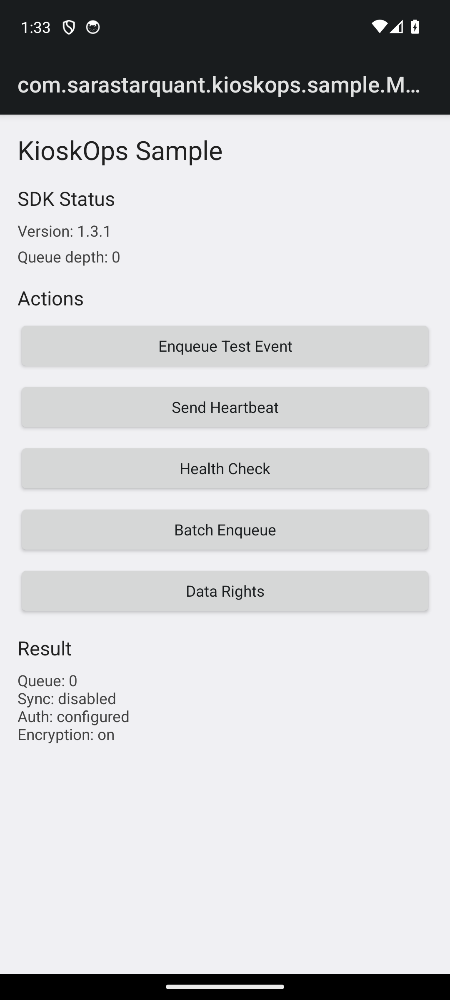
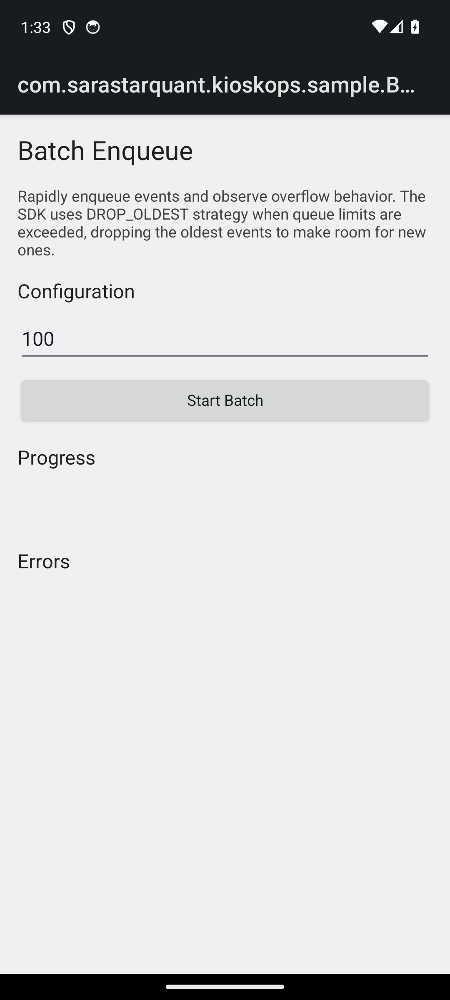
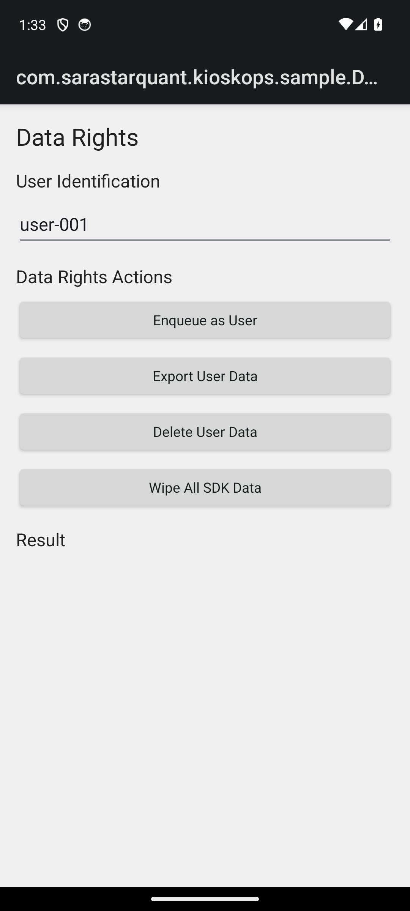

# Sample app

`sample-app` is a runnable Android app that integrates the SDK with the
`cuiDefaults()` compliance preset: encrypted queue and audit at rest, strict
validation, PII rejection, anomaly detection, and data-rights authorization.

A signed-by-debug-key demo APK is attached to each [GitHub Release](https://github.com/sara-star-quant/KioskOps-SDK-Android-Enterprise/releases)
as `kioskops-sample-demo-<version>.apk`, alongside a SHA-256 checksum and a
Sigstore `.bundle` for keyless verification. It is a debug build for evaluation,
not a production artifact.

## Screens

| Main | Batch enqueue | Data rights |
|------|---------------|-------------|
|  |  |  |

- **Main** shows SDK status (version, queue depth) and drives enqueue, heartbeat,
  and health-check calls.
- **Batch enqueue** floods the queue to show the `DROP_OLDEST` overflow strategy.
- **Data rights** exercises the GDPR-style export, delete, and full-wipe APIs
  behind the preset's authorization callback.

## Build and run

```bash
./gradlew :sample-app:assembleDebug
adb install -r sample-app/build/outputs/apk/debug/sample-app-debug.apk
```

## Integration requirements demonstrated

The preset turns on features with two host-side requirements that the app wires up:

- **Database encryption** needs SQLCipher on the classpath:
  `implementation("net.zetetic:sqlcipher-android:4.6.1")`.
- **Background work** (sync, diagnostics) uses WorkManager. The SDK does not
  register WorkManager's default initializer, so the host `Application`
  implements `Configuration.Provider` for on-demand initialization.
